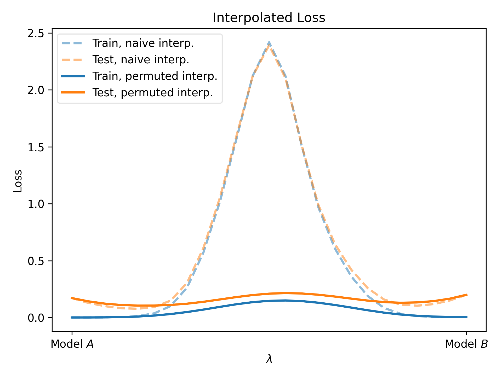
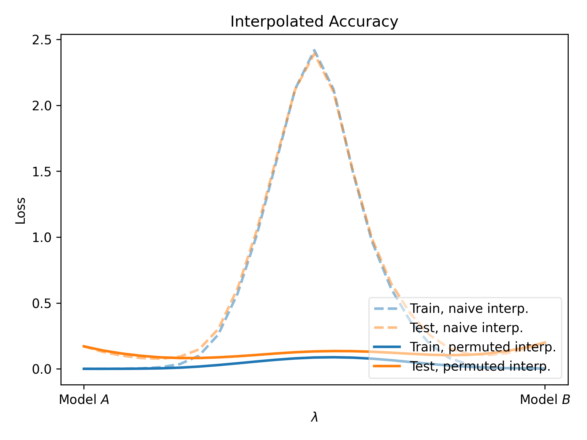
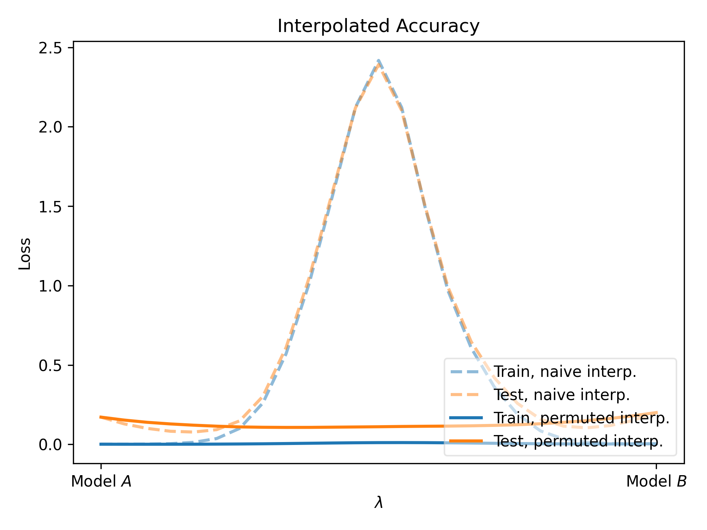
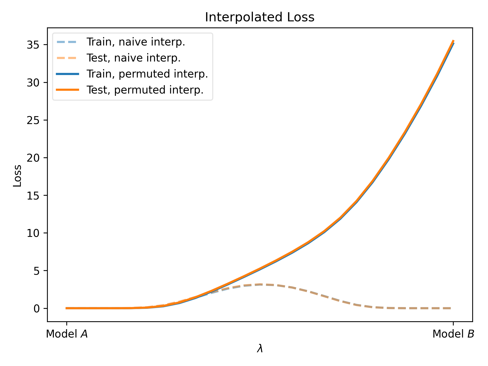
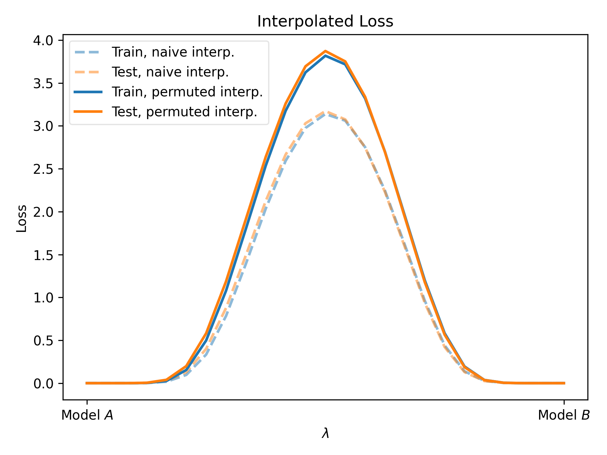
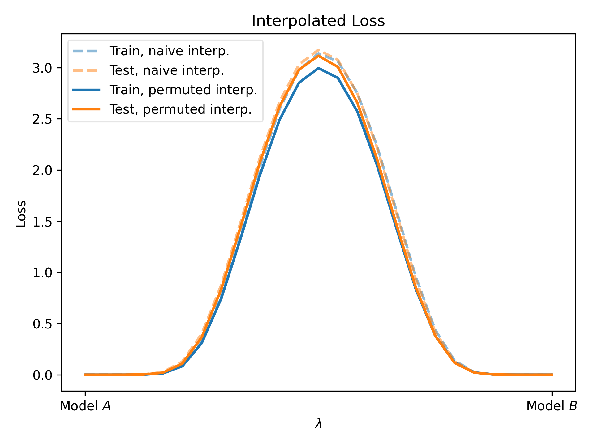
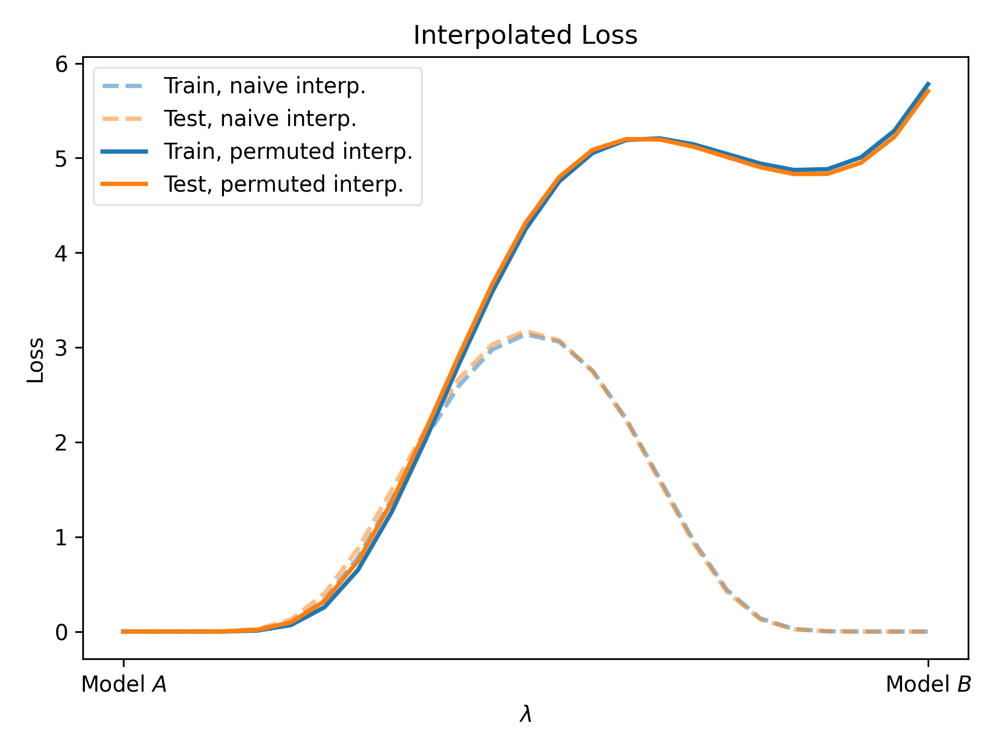

# CS 4644 Final Project: Git Re-Basin on 2L MLP trained on Modular Addition

## Purpose/Goal

The purpose of this final project is to replicate the Git Re-Basin [paper](https://arxiv.org/abs/2209.04836) on a 2L MLP trained on modular addition. The goal of this project
would be to build upon Nanda et al.'s [work](https://arxiv.org/pdf/2301.05217.pdf) into interpreting networks that have learned moduler addition via "grokking" as shown in Power et al.'s [work](https://arxiv.org/pdf/2201.02177.pdf). With Git Re-Basin, we wish to explore how basin phenomena interacts with certain architectures/tasks, such as in this case modular addition and whether linear mode connectivity exists between models that have "grokked" any task. Another goal is to replicate the paper successfully due to previous failed attempts by others and there being no codebase which implements all three algorithms. We will be using Stanislav Fort's [replication](https://github.com/stanislavfort/dissect-git-re-basin), the Git Re-Basin [codebase](https://github.com/samuela/git-re-basin), and Neel Nanda's [codebase](https://colab.research.google.com/drive/1F6_1_cWXE5M7WocUcpQWp3v8z4b1jL20#scrollTo=BhhJmRH8IIvy) as a starting point for this project.

## Setup
If you wish to run this project out of interest or to contribute, you can setup your machine using [Miniconda](https://docs.conda.io/en/latest/miniconda.html) or something similar to make a virtual environment. If you are on macOS or Linux you can use the following:

```bash
ENV_PATH=~/cs4644_final/.env/
cd $ENV_PATH
conda create -p $ENV_PATH python=3.10 -y
conda install -p $ENV_PATH pytorch=2.0.0 torchtext torchdata torchvision -c pytorch -y
conda run -p $ENV_PATH pip install -r requirements.txt
```

If you are on Windows, you can run this:

```
$env:ENV_PATH='c:\users\<user_name>\cs4644_final\.env'
cd cs4644_final
conda create -p $env:ENV_PATH python=3.10 -y
conda install -p $env:ENV_PATH pytorch=1.12.0 torchtext torchdata torchvision -c pytorch -y
conda run -p $ENV_PATH pip install -r requirements.txt
```

## Results
Below are plots taken for two experiments: training an MLP on MNIST to verify that all three algorithms are working, and an MLP that was trained on modular addition. These modular addition models are notable in that each "grokked" the task achieving 100% test accuracy after initially overfitting on training data, more can be found on the phenomenon [here](https://www.alignmentforum.org/posts/N6WM6hs7RQMKDhYjB/a-mechanistic-interpretability-analysis-of-grokking).
### MNIST Plots
- Activation Matching
    
- Weight Matching
    
- Straight Through Estimation
    

### Modular Addition Plots

(Note: Activation Matching did not work due to nature of Embedding layer)

- Weight Matching
    
- Straight Through Estimation
    

## Takeaways
The performance of the rebasin algorithms on modular additions is terrible to the point any permutation destroys model performance. However, if we don't choose to permute the embedding weights, we see curves similar to the other rebasin curves, and notice that even if we permute the other weights in the model the original grokking performance still holds:

- Weight Matching (No Embedding Permutation)
    
- Straight Through Estimation (No Embedding Permutation)
    

As shown however, naive interpolation still outperforms rebasin techniques, leading me to believe that each possible basin a grokked model could end up in is permutationally invariant, or that any permutation of the weights except embedding still lies in its original basin, hence why there is no rebasin benefit for these models.

As an addendum, these are interpolation plots where neither embedding/unembedding was permuted:
- Weight Matching
    
- Straight Through Estimation
    